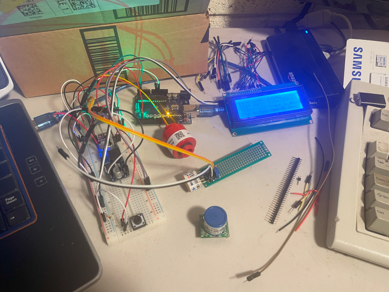

# FluidTrimixSystem
A DIY O2/Helium (Trimix) analyzer with CO monitoring as well

This project is to create a Trimix gas analyzer for technical SCUBA applications. It is currently based on an Arduino UNO R3 with a text-only LCD display, a 4-channel ADC and an O2 sensor, inert gas sensor and CO sensor.  The goal will be to migrate to an ESP32 with graphical display, yet hopefully using the same codebase.

The goal of this project is to allow users with a reasonable amount of electronics and computer skills to create a Trimix analyzer using commodity parts.  In order to complete this, you absolutely will need basic electronics skills, as well as basic familiarity with the concept of programming and the Arduino environment.  This project will not be a tutorial for these items:  there are plenty of resources for these already.  You won't need to be a 'coder', but you will need to understand the concept  of source code enough to make basic changes and compile and upload them to the device.  Beyond that, this project should hopefully give you everything you need to be able to assemble your own analyzer.

Right now, this project is a long way away from that!  So far, I have created a basic prototype.  Right now, this prototype can:
* Display information on a text-only LCD display
* Read analog information from two sensors
  * Oxygen sensor
  * He sensor
The software can warm up the sensors, perform an Air calibration, and measure O2 and He values, displaying sensor voltages and fractional percentage of O2 and He, as well as MOD, END and EAD for the gas.

That sounds great.  But right now, it's also just a pile of components on my work table...

Much work to be done...
